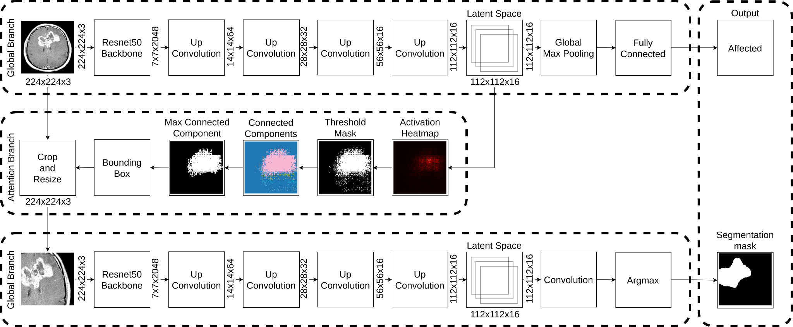
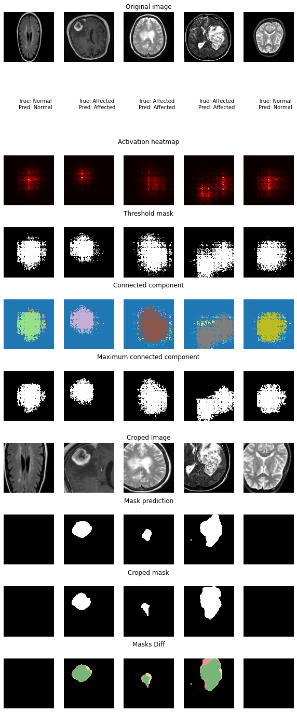

# Brain-Tumor-Detection
## MRI Classification and Segmentation for Brain Tumor Detection

These are the final results of a work developed during the course MO444 (Machine Learning) at the State University of Campinas.

## Architecture

The architecture consists of three main structures: Global Branch, Attention Branch, and Local Branch. The model uses the concept o hard-self-attention to achieve a high-resolution segmentation.

### Global Branch

This is the first segment, responsible for classifying the presence of a Brain tumor in the input image. Besides that, from the latent space of this network is extracted one of the inputs for the next segment.

### Attention Branch

This segment receives two inputs, the original input image and the latent space from the Global Branch. The latent space is used to find de region of max activation, this process is done through a threshold binarization and a max connected component analysis. This region is used to crop the original image.

### Local Branch

This is the last segment, responsible for segmenting the affected region. It uses a similar architecture to the Global Branch. The input is the region of interest extracted from the Attention Branch.

## Results

The results achieved were acceptable given the conditions. As can be seen from the test samples, the model was able to perform both tasks well.

## Dataset
[Br35H :: Brain Tumor Detection 2020](https://www.kaggle.com/datasets/ahmedhamada0/brain-tumor-detection)

## References
1. [O que são tumores cerebrais e principais sintomas](https://www.funcionalita.com.br/o-que-sao-tumores-cerebrais-e-principais-sintomas)

2. [Brain Tumor Statistics](https://www.cancer.net/cancer-types/brain-tumor/statistics)

3. [Brain Tumor Detection Notebook by Marto24 on Kaggle](https://www.kaggle.com/marto24/brain-tumor-detection/notebook)

4. [U-Net Architecture](https://lmb.informatik.uni-freiburg.de/people/ronneber/u-net)

5. [Diagnose like a Radiologist: Attention Guided Convolutional Neural Network for Thorax Disease Classification](https://arxiv.org/pdf/1801.09927.pdf)

6. [Brain Tumor Br35H Dataset](https://www.kaggle.com/ahmedhamada0/brain-tumor-detection)

7. [Hospital Sírio Libanês: Página explicativa sobre Câncer cerebral](https://www.hospitalsiriolibanes.org.br/hospital/especialidades/centro-oncologia/cerebral/Paginas/diagnosticos.aspx)
